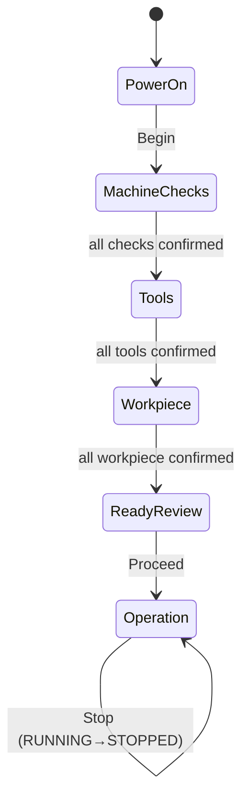

# Software Design Document (SDD)
## VMC Operator HMI — Startup Guidance

| | |
|---|---|
| **Project** | VMC Operator HMI (Vertical Machining Center) |
| **Document** | Software Design Document |
| **Version** | 1.0 |
| **Date** | 2026-09-01 |
| **Status** | Draft for review |
| **Companion** | Software Requirements Specification (SRS) v1.0 |

---

## Table of Contents
1. [Introduction](#1-introduction)
2. [System Overview](#2-system-overview)
3. [Architecture Design](#3-architecture-design)
4. [Component Design](#4-component-design)
5. [Data Design](#5-data-design)
6. [API / Interface Design](#6-api--interface-design)
7. [State Machine Design](#7-state-machine-design)
8. [User Interface Design](#8-user-interface-design)
9. [Error Handling](#9-error-handling)
10. [Deployment Design](#10-deployment-design)
11. [Testing Strategy](#11-testing-strategy)
12. [Design Traceability](#12-design-traceability)

---

## 1. Introduction

### 1.1 Purpose
This document describes **how** the VMC Operator HMI is designed and built. It is the
implementation counterpart to the SRS, which specifies *what* the system must do.

### 1.2 Scope
Covers the architecture, component responsibilities, data model, API contract, state
machine, UI design, error handling, deployment and testing of the HMI.

### 1.3 Technology Stack
| Layer | Technology | Rationale |
|---|---|---|
| Client | React + TypeScript (Vite) | Component UI, type safety, fast dev/build |
| API | Node.js + Express + TypeScript | Simple REST, shared language with client |
| Database | PostgreSQL | Relational persistence of session state |
| Tests | Vitest | Fast unit testing of rules and services |

---

## 2. System Overview

The system is a three-tier web application that guides one operator through a fixed
startup sequence and a simulated operation. The **API is authoritative**: it enforces
all progression and start/stop rules, so the UI cannot bypass them. The client is a thin
presentation layer that renders the server's state and issues actions.

```
POWER ON → MACHINE CHECKS → TOOLS → WORKPIECE → READY → RUNNING
```

---

## 3. Architecture Design

### 3.1 High-level architecture
```
┌──────────────────────────┐        ┌────────────────────────────────────────┐
│         CLIENT           │        │                 SERVER                   │
│  React + TypeScript      │        │        Node + Express + TypeScript       │
│                          │        │                                          │
│  pages/  components/      │  REST  │  routes → controllers → services         │
│  hooks/  api/  types/     │◄──────►│                    → repositories        │
│                          │  JSON  │  domain (pure rules)   middleware         │
└──────────────────────────┘        └───────────────────┬──────────────────────┘
                                                         │ SQL
                                                ┌────────▼─────────┐
                                                │   PostgreSQL     │
                                                │ sessions, items  │
                                                └──────────────────┘
```

### 3.2 Backend layering (request flow)
```
HTTP request
   │
   ▼
routes/         → declares endpoints, maps to a controller handler
   ▼
controllers/    → HTTP concerns only (parse request, send response)
   ▼
services/       → business logic; consults domain rules before writing
   ▼
repositories/   → SQL data access (sessions, items)
   ▼
db/ (pool)      → PostgreSQL
```
The **domain** layer (`workflow.ts`) holds pure, dependency-free rules and is imported by
the service. This separation makes the rules unit-testable without a database.

### 3.3 Design principles
- **Single Responsibility per layer** — HTTP, rules, and SQL never mix.
- **Server-authoritative state** — every mutating call returns the full fresh state.
- **Pure domain core** — gating logic is a set of pure functions.

---

## 4. Component Design

### 4.1 Backend components
| Module | Responsibility |
|---|---|
| `config/env.ts` | Load `.env`; expose typed config (port, DB URL, SSL). |
| `db/pool.ts` | Single PostgreSQL connection pool. |
| `db/schema.sql` | Table definitions. |
| `db/init.ts` | Run schema, ensure session, seed items (idempotent). |
| `data/scenario.ts` | Preloaded mock job and the ordered item list. |
| `domain/workflow.ts` | Pure rules: `isStageComplete`, `canAdvance`, `canStart`, `canStop`. |
| `repositories/session.repository.ts` | Read/write the session row. |
| `repositories/item.repository.ts` | Read/write and seed checklist items. |
| `services/hmi.service.ts` | Orchestrate repositories + enforce domain rules. |
| `controllers/hmi.controller.ts` | Map requests to service calls. |
| `controllers/health.controller.ts` | Liveness + DB probe. |
| `routes/*.ts` | Endpoint-to-controller wiring under `/api`, including `hmi`, `machine`, `tools`, and `workpiece` routes. |
| `middleware/errorHandler.ts` | Map `HmiError` → 400, others → 500. |
| `middleware/notFound.ts` | JSON 404 for unknown API routes. |
| `errors/HmiError.ts` | Domain error type for invalid actions. |
| `app.ts` | Assemble middleware, routes, static client. |
| `index.ts` | Init DB, then start the server. |

### 4.2 Frontend components
| Module | Responsibility |
|---|---|
| `App.tsx` | Stage router: renders exactly one page per `currentStage`. |
| `hooks/useHmi.ts` | Holds state; runs actions; swaps in server state. |
| `api/hmiApi.ts` | REST client returning the fresh `State`. |
| `types/index.ts` | Shared TypeScript types. |
| `pages/PowerOnPage.tsx` | Stage 0 — job summary + Begin. |
| `pages/MachineChecksPage.tsx` | Stage 1 — machine checks. |
| `pages/ToolsPage.tsx` | Stage 2 — tools. |
| `pages/WorkpiecePage.tsx` | Stage 3 — workpiece. |
| `pages/ReadyReviewPage.tsx` | Stage 4 — consolidated READY review. |
| `pages/OperationPage.tsx` | Stage 5 — status + Start/Stop. |
| `components/StepHeader.tsx` | Progress rail (1–5). |
| `components/TopBar.tsx` | Branding, job summary, reset. |
| `components/ChecklistStage.tsx` | Reusable confirm-each-item body (used by stages 1–3). |

---

## 5. Data Design

### 5.1 Entity-relationship
```
sessions (1) ───────< (many) items
```

### 5.2 Schema
**Table: sessions** — one row (single operator).
| Column | Type | Notes |
|---|---|---|
| id | INTEGER | Primary key (fixed = 1) |
| current_stage | INTEGER | 0–5, default 0 |
| status | TEXT | 'READY' \| 'RUNNING' \| 'STOPPED' |

**Table: items** — the confirmable checklist items.
| Column | Type | Notes |
|---|---|---|
| id | TEXT | Primary key (e.g. `chk-estop`) |
| session_id | INTEGER | FK → sessions(id), ON DELETE CASCADE |
| stage | TEXT | 'machine_checks' \| 'tools' \| 'workpiece' |
| sort_order | INTEGER | Display order |
| title | TEXT | Short label |
| detail | TEXT | Instruction detail |
| confirmed | BOOLEAN | Default FALSE |

### 5.3 Seeding
On first startup, `db/init.ts` runs `schema.sql`, ensures the session row, and — if no
items exist — inserts the ordered items from `data/scenario.ts`. Seeding is idempotent.

---

## 6. API / Interface Design

All responses are JSON. Mutating endpoints return the **complete fresh `State`**
(`currentStage`, `status`, `items[]`), so the client never has to reconcile deltas.

| Method | Endpoint | Success | Failure |
|---|---|---|---|
| GET | `/api/scenario` | 200 scenario | — |
| GET | `/api/hmi/state` | 200 State | — |
| POST | `/api/hmi/stage/next` | 200 State | 400/409 stage incomplete |
| POST | `/api/hmi/operation/start` | 200 State | 400/409 setup incomplete |
| POST | `/api/hmi/operation/stop` | 200 State | 400 not running |
| POST | `/api/hmi/reset` | 200 State | — |
| POST | `/api/machine/simulate/*` | 200 Success | 400/404 on error |
| POST | `/api/tools/:id/*` | 200 Success | 400/404 on error |
| POST | `/api/workpiece/*` | 200 Success | 400/404 on error |
| GET | `/api/health` | 200 ok | 503 DB down |

**Example — State response**
```json
{
  "currentStage": 1,
  "status": "READY",
  "items": [
    { "id": "chk-estop", "stage": "machine_checks", "sortOrder": 1,
      "title": "E-stop released", "detail": "...", "confirmed": false }
  ]
}
```

**Error shape**
```json
{ "error": "Confirm every item on this stage before continuing." }
```

---

## 7. State Machine Design



**Gating rules (enforced in `domain/workflow.ts`):**
- `canAdvance(state)` — for stages 1–3, true only when that stage's items are all
  confirmed; stages 0 and 4 always advance.
- `canStart(state)` — true only at stage 5, not already RUNNING, and all three setup
  stages complete.
- `canStop(state)` — true only at stage 5 while RUNNING.
- On stop, only `status` changes; `current_stage` is preserved.

---

## 8. User Interface Design

### 8.1 Layout
`TopBar` (brand + job) → `StepHeader` (progress rail) → one stage card. Only the active
stage is rendered.

### 8.2 Responsiveness
CSS fl/grid with relative units; a mobile breakpoint stacks checklist rows and controls
vertically. Target devices: shop-floor tablet and desktop.

### 8.3 Accessibility
- Buttons are native and keyboard operable, with visible focus outlines.
- Status uses `role="status"` + `aria-live`; errors use `role="alert"`.
- Confirm buttons carry `aria-label` naming the item.
- Large touch targets (≥ 56 px) and high-contrast status colours.

### 8.4 Visual states
- Unconfirmed item: neutral card + "Confirm".
- Confirmed item: green card + "✓ Confirmed".
- Primary action disabled until its precondition is met.
- Operation status panel colour-coded: READY (blue), RUNNING (green, pulsing),
  STOPPED (red).

---

## 9. Error Handling

| Situation | Handling |
|---|---|
| Invalid operator action | Service throws `HmiError` → middleware returns 400 + message |
| Unknown API route | `notFound` middleware → 404 JSON |
| Unexpected/server error | Logged; middleware returns 500 generic message |
| DB unavailable | `/api/health` returns 503; startup fails fast with a clear log |
| Client fetch error | `useHmi` captures the message and shows an alert banner |

---

## 10. Deployment Design

- **Single service:** the API serves the built React client (`client/dist`) if present,
  so the whole app runs at one URL.
- **Blueprint:** `render.yaml` provisions a free PostgreSQL and a Node web service, wires
  `DATABASE_URL`, and sets the health-check path.
- **Config via env:** `DATABASE_URL`, `PORT`, `PGSSL`.
- **Build:** `client` → `vite build`; `server` runs via `tsx` (no separate compile step).

```
Build:  cd client && npm install && npm run build && cd ../server && npm install
Start:  cd server && npm start
```

---

## 11. Testing Strategy

| Level | What | File |
|---|---|---|
| Unit (domain) | Pure gating rules | `domain/workflow.test.ts` |
| Unit (service) | Gates + data-layer calls (mocked repos) | `services/hmi.service.test.ts` |
| Manual | UI flow, responsiveness, reload persistence | — |

Run: `cd server && npm test`. Current suite: **17 tests**.

---

## 12. Design Traceability

| SRS requirement | Design element |
|---|---|
| FR-11 Next gating | `canAdvance` → `hmiService.advance` |
| FR-9 Start gating | `canStart` → `hmiService.start` |
| FR-10 Stop preserves stage | `hmiService.stop` (status only) |
| FR-12 One stage at a time | `App.tsx` stage router |
| FR-13 Persistence | `sessions`/`items` tables + repositories |
| FR-15 Server-enforced rules | service + domain layers |
| NFR-3 Accessibility | `styles.css` + ARIA in components |
| NFR-10 Live URL | `render.yaml` single-service deployment |

---

*End of SDD.*
